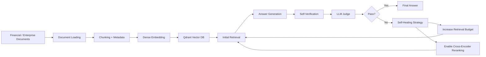
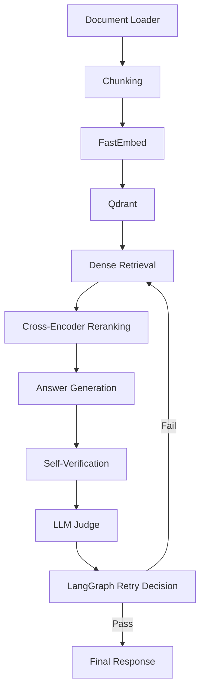

# FinRAG | Adaptive Self-Healing RAG System

A Retrieval-Augmented Generation system for financial and enterprise documents that evaluates its own retrieval and generated answers at query time and automatically adapts when it detects poor context or unsupported claims.

**Author:** Navadeep Nandedapu

---

## Overview

Standard RAG pipelines retrieve context once, generate an answer once, and return the result even when retrieval is incomplete or irrelevant. This project treats retrieval and generation as failure-prone stages and adds an explicit evaluation-and-recovery loop.

The system combines dense retrieval, cross-encoder reranking, self-verification, and LLM-as-a-judge evaluation inside a LangGraph workflow. When a result fails its checks, the system changes its retrieval strategy and tries again within a bounded retry budget.

## Pipeline



Each query moves through retrieval, generation, verification, and judging. A failed attempt is routed back to retrieval with an adapted strategy rather than simply repeating the same operation.

## Self-Healing Strategy

The retry decision is triggered when:

```text
score < 0.8
OR
failure_reason != "none"
OR
unsupported_claims == true
```

The recovery strategy depends on the detected failure:

| Failure reason | Recovery action |
|---|---|
| `unsupported_claims` | Increase retrieval budget by 2 + enable reranking |
| `irrelevant_docs` | Increase retrieval budget by 2 + enable reranking |
| `missing_context` | Increase retrieval budget by 3 + enable reranking |
| Maximum retries reached | Stop retrying and return the current result |

Retries are bounded by a maximum retry count. The vector store is reused across retries, so documents are embedded once during ingestion rather than re-embedded for every attempt.

## Architecture



The workflow is implemented as an explicit LangGraph control flow. Verification checks whether generated claims are supported by retrieved context, while the judge independently evaluates context relevance, context sufficiency, and answer quality.

### Models

| Purpose | Model |
|---|---|
| Embedding | `sentence-transformers/all-MiniLM-L6-v2` via FastEmbed |
| Reranking | `jinaai/jina-reranker-v2-base-multilingual` |
| Generation | `openai/gpt-oss-120b` via Groq |
| Self-verification | `openai/gpt-oss-20b` via Groq |
| Judge | `openai/gpt-oss-20b` via Groq |

## Features

- **Multi-document ingestion** — loads and chunks multiple PDFs from local files or external URLs
- **Source-aware chunks** — preserves originating document or URL metadata
- **Dense vector retrieval** over Qdrant
- **Selective cross-encoder reranking** during recovery
- **Self-verification** for answer faithfulness to retrieved context
- **LLM-as-a-judge** evaluation of relevance and context sufficiency
- **Adaptive self-healing** with bounded retries
- **Execution tracing** — reports retrieval mode, retrieval budget, retry count, and healing actions
- **REST API** with `/health`, `/ingest`, and `/query`
- **Streamlit UI** for interactive ingestion and querying
- **Dockerized backend** designed to run with Qdrant as a separate service

## Evaluation

The evaluation set is inspired by the structure of FinanceBench and focuses on questions grounded in real company SEC filings. The current evaluation uses 10 straightforward questions across five company filings, covering factual retrieval tasks such as revenue, net income, assets, employees, and business segments.

### Evaluation setup

- **Evaluation queries:** 10
- **Baseline:** original dense retrieval
- **Baseline retrieval budget:** top-5 chunks
- **Self-healing pipeline:** starts with the same top-5 retrieval budget
- **Maximum retries:** 3
- **Baseline success:** whether the ground-truth answer components appear in the initial top-5 retrieved chunks
- **Final success:** whether the expected ground-truth answer appears in the generated final answer

### Results

| Metric | Result |
|---|---:|
| Evaluation queries | **10** |
| Baseline retrieval success | **5/10 (50%)** |
| Automated final pipeline success | **7/10 (70%)** |
| Improvement over baseline | **+20 percentage points** |
| Genuine baseline failures recovered | **2/5 (40%)** |
| Maximum retries | **3** |

The evaluation demonstrates that the self-healing loop can recover genuine retrieval failures rather than merely retrying the same retrieval operation.

### Key engineering findings

- **Self-healing can recover genuine retrieval failures.** The pipeline successfully recovered two baseline failures after changing its retrieval strategy.
- **More retrieval is not automatically better.** Some failed queries reached a retrieval budget of 11 and still did not produce a correct answer, showing that simply increasing `k` has limits.
- **Verification has an entity-alignment gap.** A response can be supported by retrieved context while still coming from the wrong company's document; content support alone does not guarantee entity correctness.
- **Judge score is not equivalent to factual correctness.** High judge scores can occur even when the final answer is factually wrong, so the judge is an evaluation signal rather than ground truth.
- **Evaluation methodology has limits.** String-based ground-truth matching can produce false negatives when the answer is semantically correct but phrased differently.

## API Usage

### Health check

```http
GET /health
```

### Ingest a document

```http
POST /ingest
{
  "source": "https://arxiv.org/pdf/2312.10997"
}
```

Returns the number of chunks ingested and the total stored in the collection.

### Query

```http
POST /query
{
  "question": "What was Microsoft's total revenue for fiscal year 2026?"
}
```

Example response:

```json
{
  "answer": "...",
  "score": 0.95,
  "retrieval_mode": "dense_rerank",
  "retrieval_budget": 7,
  "retry_count": 1,
  "healing_trace": [
    "Irrelevant docs → increased retrieval budget by 2 + enabled reranking"
  ]
}
```

These fields make the recovery process observable instead of hiding it behind the final answer.

## Getting Started

Requires Python 3.11+. Docker commands below use PowerShell syntax but are OS-agnostic in intent.

### 1. Clone and configure

```bash
git clone https://github.com/NNavadeep05/adaptive-self-healing-rag.git
cd adaptive-self-healing-rag
```

Create a `.env` file:

```env
GROQ_API_KEY=your_groq_api_key_here
QDRANT_URL=http://qdrant:6333
```

`.env` is git-ignored and should never be committed. For a purely local setup without Dockerized Qdrant, point `QDRANT_URL` at your locally running Qdrant instance instead.

### 2. Option A — Local Streamlit + local Qdrant

```bash
python -m venv .venv
.\.venv\Scripts\Activate.ps1
pip install -r requirements.txt
streamlit run app.py
```

Qdrant must be reachable at the configured `QDRANT_URL`.

### 3. Option B — Dockerized backend + Qdrant

```powershell
docker network create rag-network

docker run -d `
  --name qdrant `
  --network rag-network `
  -p 6333:6333 -p 6334:6334 `
  qdrant/qdrant

docker build -t adaptive-self-healing-rag .

docker run -d `
  --name adaptive-self-healing-rag `
  --env-file .env `
  --network rag-network `
  -p 8000:8000 `
  adaptive-self-healing-rag
```

Inside the Docker network, the backend reaches Qdrant through its service name (`http://qdrant:6333`). `localhost` inside the backend container refers to the backend itself.

The Streamlit UI runs separately:

```bash
streamlit run app.py
```

## Project Structure

```text
adaptive-self-healing-rag/
├── api.py                         # FastAPI backend and REST endpoints
├── app.py                         # Streamlit UI
├── requirements.txt
├── Dockerfile
├── .dockerignore
├── .gitignore
├── eval_queries.json              # Evaluation query set
├── eval/
│   ├── baseline_retrieval.py      # Baseline retrieval evaluation
│   ├── full_pipeline_eval.py      # End-to-end self-healing evaluation
│   └── full_pipeline_results.json # Detailed evaluation results
└── langgraph_agent/
    ├── document_loader.py         # PDF loading, URL download, chunking
    ├── retrieve_docs.py           # Embeddings, retrieval, reranking, LLM calls
    ├── nodes.py                   # LangGraph nodes and healing logic
    ├── graph.py                   # LangGraph workflow construction
    └── __init__.py
```

## Repository Data

The raw SEC filing corpus and local Qdrant storage are intentionally excluded from Git because they are local evaluation/runtime data.

The repository contains the evaluation query set and evaluation scripts/results. To run the evaluation locally, place the required SEC filing corpus under:

```text
data/sec_filings/
```

The five filings used during evaluation are:

```text
amazon_2025.html
jpmorgan_2025.html
microsoft_2026.html
nvidia_2026.html
walmart_2026.html
```

## Run Evaluation

After configuring the environment and populating the local evaluation corpus:

```bash
python eval/baseline_retrieval.py
python eval/full_pipeline_eval.py
```

The full-pipeline evaluation writes detailed per-query results to:

```text
eval/full_pipeline_results.json
```

## License

This project is intended as an engineering and portfolio demonstration of adaptive retrieval and self-healing RAG workflows.
